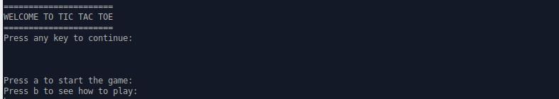
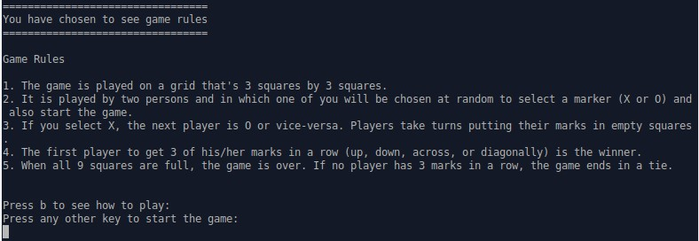
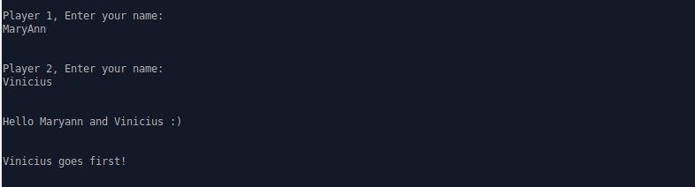
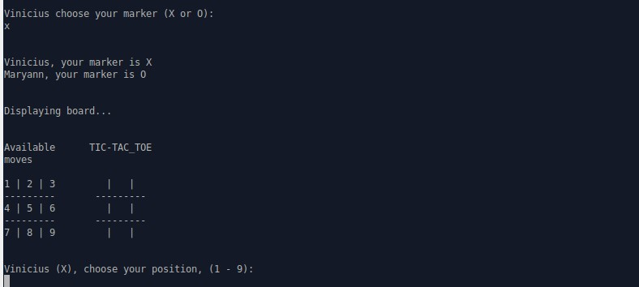
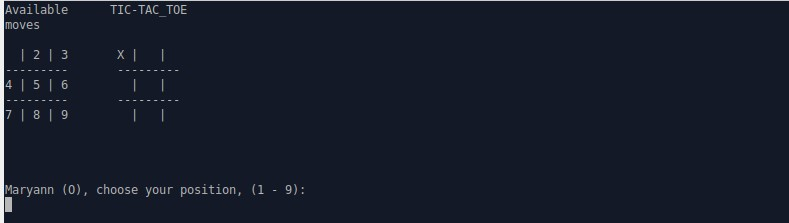
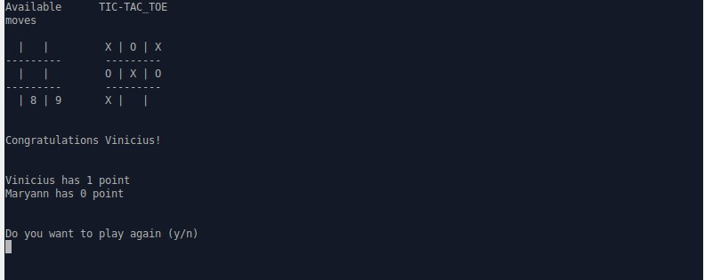

# Project Name
Tic Tac Toe Game

## Table of contents
* [General info](#general-info)
* [Game Instructions/Rules](instructions)
* [Setup](#setup)
* [Technologies](#technologies)
* [Features](#features)
* [Status](#status)
* [Contact](#contact)

## General info
This project was built so as to pratice the main concept of using an OOP language, its classes and attributes by creating a full app. It was created and built by <a href="https://github.com/adaorachi">MaryAnn Chukwuka</a> and <a href="https://github.com/kazumaki">Vinicius Campos Carvalho</a>.

## Game Instructions/Rules
Tic-tac-toe is a game played by two persons.  
* The game is played on a grid that's 3 squares by 3 squares.
* It is played by two persons and in which one of you will be chosen at random to select a marker (X or O) and also start the game.
* If you select X, the next player is O or vice-versa. Players take turns putting their marks in empty squares.
* The first player to get 3 of his/her marks in a row (up, down, across, or diagonally) is the winner.
* When all 9 squares are full, the game is over. If no player has 3 marks in a row, the game ends in a tie.

## How to play game
Below is a detailed illustrations on how to play our Tic-Tac_Toe game.
* The game welcomes you and gives you options to press.
 
* If you press 'b', you'll be given a detailed instructions on how to play game.
 
* If you press 'a', you'll be opting to start the game, where it'll prompt both players to enter their names. This is to make the game interactive. It also picks a player at random to choose a marker and also start the game.
 
* When the player chosen at random picks a marker (X or O), the game intuitively assigns the other marker to the other player. The game also displays the board with two grids. The first shows the available spaces numbered 1 to 9, while the second shows empty cells where the markers will be entered. It also asks the player chosen at random to enter his/her position (from number 1 to 9).
 
* The game takes turns in asking players for their positions and it intuitively places their markers in the right numbered cells in the tic-tac-toe grid board which corresponds to their chosen positions. The available grid board also displays the cells available.
 
* The first player to get 3 of his/her marks in a row (up, down, across, or diagonally) is the winner. The game displays a congratulatory message to the winner, displays the scores and ask if the players would want to play again. Enter 'y' to continue or 'n' to end the game.
 
* When no player wins and the board is filled, it ends the game and displays a game tie message.
 

## Setup
This project is a basic Ruby Program. It is pretty simple to setup. All you have to do is to clone the project into your local repository. The game can only be played in the terminal. 
* Open CLI
* Run git clone https://github.com/adaorachi/tic-tac-toe
* cd bin/
* Run ruby main.rb

## Technologies
* Ruby (OOP language)
* VSCode (Text Editor)

## Features
List of features ready and TODOs for future development
* The project is complete at the moment. There are no future features or development to do.

## Status
The project is currently finished.

## Contact
Created by [@MaryAnn Chukwuka](https://github.com/adaorachi) and [@Vinicius Campos Carvalho](https://github.com/kazumaki), feel free to contact us!
